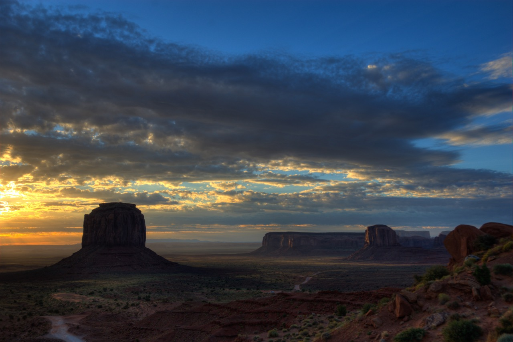

<figure>

<figcaption>
Monument Valley, Arizona.
<figcaption>
</figure>

I arrived late in the evening at Monument Valley, tired from the long drive from Bryce Canyon. I pitched my tent on a narrow strip of sand next to the Navajo visitor centre car park, and fell asleep.

I woke at dawn to this view--the iconic backdrop of the cowboy movies of my childhood. I felt the usual prickle of not-quite-recognition that attended much of my drive round the US that year.

Within an hour, the car park was beginning to fill. But for an hour, I had this magical place to myself.